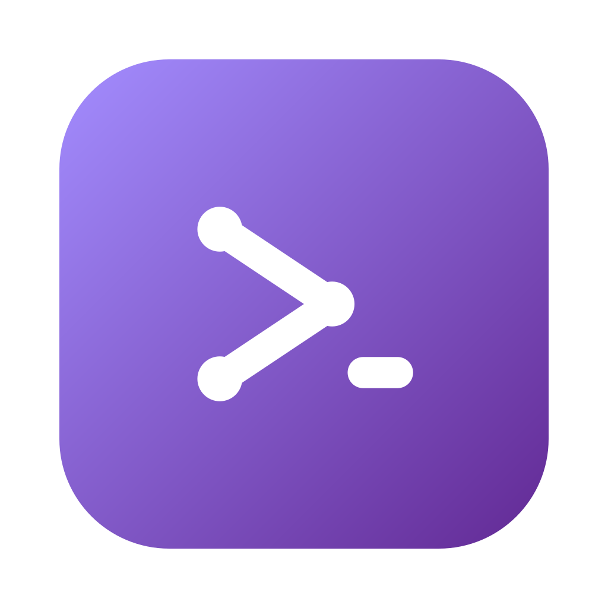
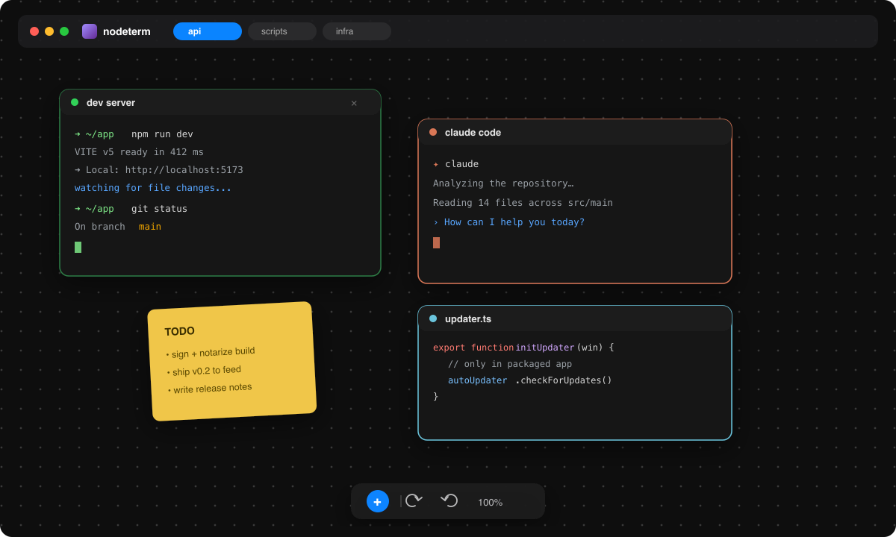

<div align="center">



# nodeterm-linux

**A node-based terminal manager for Linux — your terminals on an infinite canvas.**

Multiple real terminals live as draggable nodes on a single pan/zoom canvas.
Built for people with ADHD and scattered workflows: a spatial layout instead of
a stack of hidden tabs.

[-black)]()
[](https://www.electronjs.org/)
[](./LICENSE)
[](https://github.com/dazeb/nodeterm-linux)
[](https://github.com/dazeb/nodeterm-linux/releases)

[Download](#-download) · [Features](#-features) · [Build from source](#-build-from-source) · [Architecture](#-architecture) · [License](#-license)

</div>

---

<div align="center">
  
  <br/>
  <sub><i>Illustration of the canvas — swap in a real screenshot/GIF when ready.</i></sub>
</div>

## Why nodeterm-linux

This is a **Linux desktop port** of [nodeterm](https://github.com/eneskirca/nodeterm), originally built for macOS. The core codebase is the same — the architecture was designed with a clean platform seam (`CorePlatform`) that made the port straightforward. All features work on Linux with no subscription gating.

Stacked terminal tabs hide context — you lose track of what's running where. nodeterm turns that into a **map**: every shell is a node you can place, group, label, and zoom into. Sessions are spatial and persistent, so your mental model stays intact across restarts.

**What's different in this fork:**
- All Pro/subscription features are free — no license keys, no paywalls
- Linux desktop builds (AppImage + .deb)
- Keyboard shortcuts use Ctrl instead of ⌘
- Telegram bot integration instead of macOS phone pairing

## ✨ Features

- **Real terminals as nodes** — each node runs its own shell (PTY) via `node-pty`; drag,
  resize, pan, and zoom freely on a React Flow canvas.
- **Session continuity (tmux)** — terminals keep running across node remounts *and* full
  app restarts, including live processes. Close a node's × to truly end its session.
- **Projects / tabs** — each project is its own canvas with its own working directory;
  switch between them without losing any running terminal.
- **Many node kinds**, all on the same canvas:
  - 🖥 **Terminal** — xterm + tmux, click-to-rename, color, tags, AI naming.
  - 🤖 **Agent** — a terminal preset that launches an agent CLI: **Claude Code**, **Codex**,
    **Gemini**, or your own custom command.
  - 💬 **Chat** — an SDK-driven Claude chat node (streaming, in-chat permission prompts,
    image paste, cost meter) — not a PTY.
  - 📝 **Sticky note** — free-text colored notes; link one to an agent to feed it context.
  - 🗂 **Group** — frame and move related nodes together.
  - ✏️ **Editor** — Monaco code editor for a file (Ctrl+S to save, markdown/image preview).
  - 🔀 **Diff** — Monaco diff editor for staged/unstaged changes.
  - 🌐 **Web / Video** — render a page or a video right on the canvas.
- **Live agent status** — hook-driven **RUNNING / NEEDS YOU** badges, **subagent** cards
  with a live transcript, a **context-window meter**, and unread dots + completion
  notifications — for Claude, Codex, and Gemini, no output-scraping.
- **Agent superpowers** — **context links** so two agent nodes (Claude / Codex / Gemini) can
  read each other's transcript on demand, plus Claude-only **branch a conversation** into a
  new node and **managed accounts** to run several logged-in Claude identities side by side.
- **Remote / SSH projects** — open a project on a remote host over SSH; terminals, files,
  and git run there while the canvas stays local.
- **Source control** — VS Code-style file-level stage/unstage, discard, branch
  switch/create, commit, push/sync/publish, worktrees, and `gh` sign-in — backed by
  system `git`.
- **AI commit messages & terminal names** — bring-your-own local agent CLI
  (claude / codex / custom) run read-only on the staged diff or captured output.
- **Command palette** (Ctrl+K), **file explorer** (Ctrl+⇧E), **markdown view** (Ctrl+M),
  **undo/redo** (Ctrl+Z / Ctrl+⇧Z), and a native dark UI.
- **Auto-update & in-app announcements** — the app checks an update feed and
  surfaces a "Restart to update" banner and product news.
- **Telegram bot (free)** — control your terminals remotely via Telegram. List
  sessions, view output, and send commands from your phone. No relay server needed.
  Set up in Settings → Telegram with a bot token from @BotFather.

### 🤖 Telegram Bot — terminals on your phone

Control your terminals from anywhere via Telegram. The bot runs on the same machine as nodeterm and connects directly to your tmux sessions — no relay, no cloud service, no subscription.

**Setup:**
1. Open nodeterm → Settings → Telegram
2. Create a bot via [@BotFather](https://t.me/botfather) and copy its API token
3. Paste the token into nodeterm and click Start
4. Scan the QR code or tap the link to open the bot on your phone

**Commands:**
| Command | Action |
| --- | --- |
| `/terminals` | List active terminal sessions |
| `/attach N` | View terminal N's current output |
| `/send N <text>` | Send input to terminal N |
| `/help` | Show all commands |

Terminals, editors, the git panel, and agent-status badges all work in the
browser today; the SDK chat node is desktop-only. See
[`docs/SERVER.md`](./docs/SERVER.md) for details.

## 📦 Download

Download the latest `.AppImage` or `.deb` from the
**[GitHub releases](https://github.com/dazeb/nodeterm-linux/releases)** page.

## 🛠 Build from source

Requires Node.js 20+ and tmux.

```bash
npm install        # deps + rebuilds node-pty against Electron's ABI (postinstall)
npm run dev        # dev mode with renderer HMR
npm run build      # production build into out/
npm start          # preview the production build
npm run typecheck  # fastest correctness gate
npm test           # vitest unit + integration suite
npm run dist:linux # local AppImage + .deb into dist/
npm run server:dev # build + run the browser Server Edition (needs Node 22+)
```

`npm run dist:linux` builds an AppImage and `.deb` into `dist/`. `npm run server:dev` runs the headless browser edition.

## ⌨️ Keyboard shortcuts

| Shortcut | Action |
| --- | --- |
| `Ctrl+K` | Command palette |
| `Ctrl+T` / `Ctrl+⇧C` | New terminal / New Claude Code |
| `Ctrl+W` | Close the selected node |
| `Ctrl+Z` / `Ctrl+⇧Z` | Undo / Redo |
| `Ctrl+M` | Toggle markdown view (terminal / editor) |
| `Ctrl+⇧E` | File explorer |
| `Ctrl+,` / `Ctrl+/` | Settings / Shortcuts |
| `Right-click` | Actions menu (empty space or node) |

## 🏗 Architecture

- **Electron, three contexts** — `src/main` (the Electron shell), `src/preload` (the only
  bridge, `window.nodeTerminal`), `src/renderer` (React UI). `src/shared` holds the types
  and IPC channel names used by all three.
- **`CorePlatform` seam** — every service (PTY, workspace/settings, git, agents, hooks) lives
  in `src/core` behind a small platform interface and never imports `electron`. Electron is
  one implementation of that seam; the browser Server Edition (`src/server`) is another,
  booting the exact same services over a WebSocket-RPC bridge (`src/renderer/bridge` fills
  `window.nodeTerminal` in the browser). One codebase, one renderer, multiple shells.
- **`TerminalTransport` abstraction** — the renderer depends only on this interface, never on
  IPC or node-pty directly. `LocalTransport` talks to the local host; `RemoteTransport` talks
  to a remote agent over SSH — so remote projects drop in without touching the canvas UI.
- **React Flow is the single source of truth** for live nodes; projects persist serialized
  nodes to disk, and tmux keeps sessions alive across restarts.
- **Three surfaces** — the desktop app, the browser **Server Edition**, and an in-progress
  **mobile companion** (a separate SwiftUI repo) all ride the same core + transport seams.

See [`CLAUDE.md`](./CLAUDE.md) for the full design notes and gotchas, and
[`docs/SERVER.md`](./docs/SERVER.md) for the Server Edition.

## 📋 Changelog

### v0.4.1 — Fix app refusing to launch (electron + node-pty bundling)

The v0.4.0 release was broken on Linux: the app crashed immediately on launch
with "Electron failed to install correctly" or a blank window. Three compounding
build-config bugs in the electron-vite config caused this:

- **`electron` was bundled into the main process output** instead of being kept
  external. Because `electron` is a `devDependency`, the `externalizeDepsPlugin`
  (which reads `dependencies`) didn't externalize it — so the npm install wrapper
  (`node_modules/electron/index.js`) got inlined, and at runtime the app tried to
  *download* Electron instead of using the built-in module.
  **Fix:** explicitly add `electron` to the rollup `external` list.
- **`node-pty`'s internal library was bundled** even though it's a runtime
  dependency. Its native-module loader uses relative paths that resolve against
  its own package directory at runtime; bundling broke those paths, causing
  "Cannot find module pty.node" at startup.
  **Fix:** explicitly add `node-pty` (string + regex) to `external`.
- **`electron-updater`'s default import was undefined** under CJS interop. The
  `import electronUpdater from 'electron-updater'` + destructure pattern
  produced `undefined` when rollup wrapped the CJS module.
  **Fix:** switch to a named import: `import { autoUpdater } from 'electron-updater'`.

Verified: the production build now launches successfully (main process, GPU,
network, and renderer all spawn), with only a harmless WebGL2 blocklist warning
on headless/WSL environments.

### v0.4.0 — Linux release workflow + CJS output

- Switched automatic updates from upstream `nodeterm.dev` to GitHub Releases.
- Updated the release workflow to build Linux (AppImage + .deb) artifacts.
- Forced CJS output (`.js`) in the electron-vite config for asar compatibility.
- Fixed the `main` entry in `package.json` (`index.js` → `index.mjs`, then back).

### v0.3.0 — Initial Linux port

- Forked from [eneskirca/nodeterm](https://github.com/eneskirca/nodeterm) (macOS).
- Renamed product/appId to `nodeterm-linux`, bumped version.
- All Pro/subscription features unlocked — no license keys, no paywalls.
- Keyboard shortcuts use Ctrl instead of ⌘.
- Telegram bot integration replacing macOS phone pairing.

## 🤝 Contributing

This is a Linux port maintained by [dazeb](https://github.com/dazeb). The upstream
codebase by [eneskirca](https://github.com/eneskirca) is at
[github.com/eneskirca/nodeterm](https://github.com/eneskirca/nodeterm).

Issues and pull requests are welcome. nodeterm is licensed under the
[Business Source License 1.1](https://mariadb.com/bsl11/) — you can use, modify,
and redistribute it freely, including in production, except offering it as a
competing product or service (see [License](#-license)).

By submitting a contribution (pull request, patch, or code snippet), you agree
that it is licensed under the same [BUSL-1.1](./LICENSE) terms as the rest of
the project, and that the project may continue to relicense future versions
(including your contribution) as part of its normal licensing model.

## 📜 License

**[BUSL-1.1](./LICENSE)** ([Business Source License](https://mariadb.com/bsl11/)): you may
copy, modify, redistribute, and — under the Additional Use Grant — make **production
use** of nodeterm; the one thing you may not do is offer it (hosted, embedded, or as a
standalone product/service) in a way that **competes** with nodeterm or with the
Licensor's products built on it. Each release automatically becomes plain **MIT** four
years after it is published. See [`LICENSE`](./LICENSE) for the full terms and
[`THIRD-PARTY-NOTICES.md`](./THIRD-PARTY-NOTICES.md) for the bundled open-source
components.

> "Claude" and "Claude Code" are trademarks of Anthropic; nodeterm is not affiliated with
> or endorsed by Anthropic.
